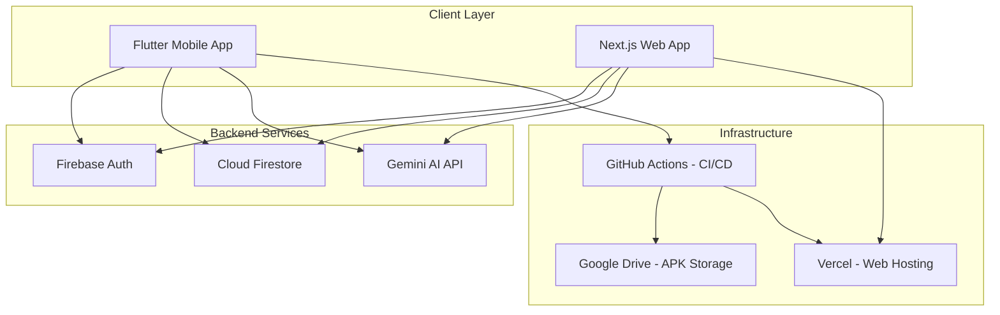
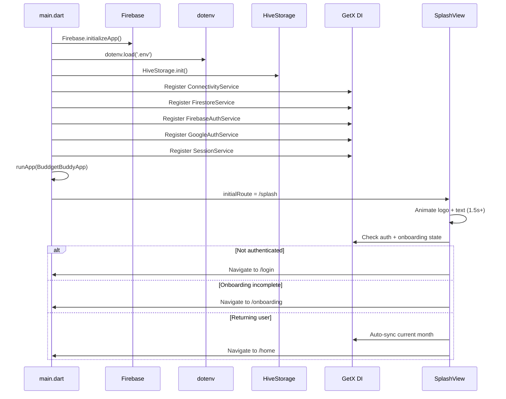
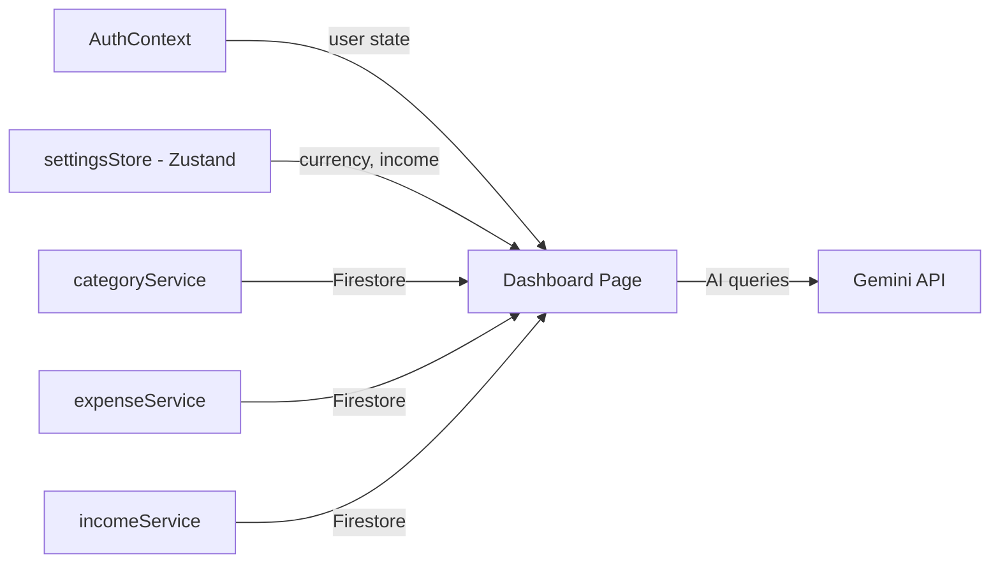
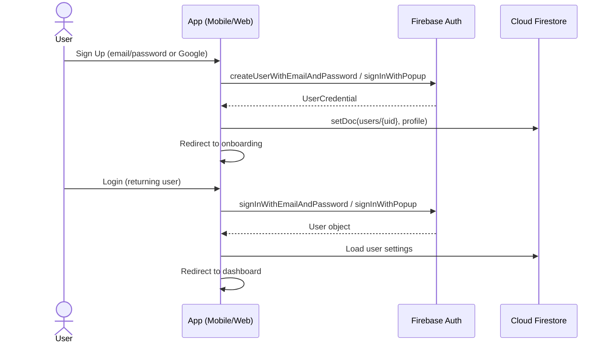
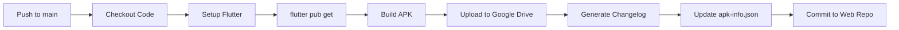
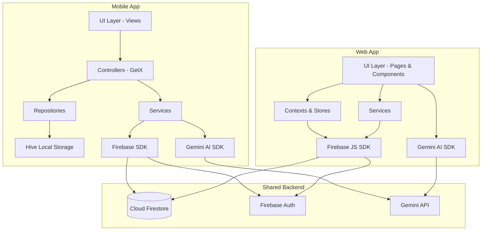

# 🏗️ Technical Engineering Requirements Document (TERD)
# BuddgetBuddy — Personal Finance Management Platform

**Version:** 1.1  
**Date:** March 5, 2026  
**Author:** Syed Uzaif  
**Status:** Active Development

---

## 1. System Overview

BuddgetBuddy is a dual-platform personal finance management system consisting of:

1. **Mobile Application** — Flutter (Dart) targeting Android & iOS
2. **Web Application** — Next.js 16 (React 19 + TypeScript) deployed on Vercel
3. **Backend Services** — Firebase (Auth, Firestore) + Google Gemini AI
4. **CI/CD Pipeline** — GitHub Actions for automated APK builds



---

## 2. Technology Stack

### 2.1 Mobile Application (Flutter)

| Component | Technology | Version |
|-----------|-----------|---------|
| **Framework** | Flutter | 3.0+ |
| **Language** | Dart | 3.0+ |
| **State Management** | GetX | 4.6.6 |
| **Local Storage** | Hive + Hive Flutter | 2.2.3 / 1.1.0 |
| **Authentication** | Firebase Auth | 6.1.3 |
| **OAuth** | Google Sign-In | 6.2.2 |
| **Cloud Database** | Cloud Firestore | 6.1.1 |
| **AI Integration** | Google Generative AI | 0.4.7 |
| **Charts** | fl_chart | 0.70.0 |
| **Network Monitoring** | connectivity_plus | 7.0.0 |
| **Date Formatting** | intl | 0.20.2 |
| **Typography** | Google Fonts | 6.1.0 |
| **Environment Config** | flutter_dotenv | 6.0.0 |
| **ID Generation** | uuid | 4.5.2 |
| **Code Generation** | build_runner + hive_generator | 2.4.6 / 2.0.1 |

### 2.2 Web Application (Next.js)

| Component | Technology | Version |
|-----------|-----------|---------|
| **Framework** | Next.js | 16.1.6 |
| **Language** | TypeScript | 5.x |
| **UI Library** | React | 19.2.3 |
| **State Management** | Zustand | 5.0.11 |
| **UI Components** | Radix UI + shadcn/ui | 1.4.3 / 3.8.4 |
| **Styling** | Tailwind CSS | 4.x |
| **Animations** | Framer Motion | 12.34.3 |
| **Charts** | Recharts | 3.7.0 |
| **Form Handling** | React Hook Form + Zod | 7.71.1 / 4.3.6 |
| **Date Handling** | date-fns + react-day-picker | 4.1.0 / 9.13.2 |
| **Icons** | lucide-react | 0.563.0 |
| **Toasts** | Sonner | 2.0.7 |
| **Theming** | next-themes | 0.4.6 |
| **AI Integration** | @google/generative-ai | 0.24.1 |
| **Firebase** | firebase (JS SDK) | 12.9.0 |
| **Analytics** | @vercel/analytics + speed-insights | 1.6.1 / 1.3.1 |

### 2.3 Backend & Infrastructure

| Component | Technology |
|-----------|-----------|
| **Authentication** | Firebase Auth (Email/Password + Google OAuth) |
| **Database** | Cloud Firestore (NoSQL) |
| **AI** | Google Gemini 2.5 Flash |
| **Web Hosting** | Vercel |
| **CI/CD** | GitHub Actions |
| **APK Storage** | Google Drive (via rclone) |

---

## 3. Architecture

### 3.1 Mobile App Architecture (Flutter)

The Flutter app follows a **modular clean architecture** pattern with GetX for dependency injection and reactive state management.

```
lib/
├── main.dart                           # Entry point, service initialization
├── firebase_options.dart               # Firebase config (auto-generated)
│
├── core/                               # Foundation layer
│   ├── animations/                     # Reusable animation widgets
│   ├── constants/                      # App-wide constants
│   │   ├── app_constants.dart          #   Centralized app name, version, tagline
│   │   └── app_icons.dart              #   Icon code point mappings
│   ├── theme/                          # Design tokens
│   │   ├── app_theme.dart              #   Light & dark theme definitions
│   │   ├── app_colors.dart             #   Color palette
│   │   ├── app_fonts.dart              #   Typography scale
│   │   └── app_spacing.dart            #   Spacing system
│   └── widgets/                        # Shared UI components
│
├── data/                               # Data layer
│   ├── models/                         #   Domain models
│   │   ├── category.dart               #     Budget category + Hive adapter
│   │   ├── transaction_item.dart       #     Transaction + Hive adapter
│   │   ├── income_model.dart           #     Monthly income + Hive adapter
│   │   └── chat_message_model.dart     #     AI chat message + Hive adapter
│   ├── repositories/                   #   Data access layer
│   │   ├── category_repository.dart    #     Category CRUD operations
│   │   ├── transaction_repository.dart #     Transaction CRUD operations
│   │   ├── income_repository.dart      #     Income CRUD operations
│   │   └── chat_repository.dart        #     Chat history persistence
│   ├── local/                          #   Local storage abstraction
│   │   └── hive_storage.dart           #     Hive initialization & boxes
│   └── predefined_categories.dart      #   Default category templates (9 presets)
│
├── services/                           # Service layer
│   ├── app/                            #   Application services
│   │   ├── gemini_service.dart         #     Gemini AI integration
│   │   ├── connectivity_service.dart   #     Network monitoring
│   │   ├── session_service.dart        #     User session management
│   │   └── settings_service.dart       #     App preferences
│   └── firebase/                       #   Firebase services
│       ├── firebase_auth_service.dart  #     Auth operations
│       ├── firestore_service.dart      #     Firestore CRUD
│       └── google_auth_service.dart    #     Google OAuth
│
├── modules/                            # Feature modules (GetX pattern)
│   ├── splash/                         #   Animated branded splash screen
│   ├── auth/                           #   Login / Sign-up
│   ├── onboarding/                     #   First-time setup wizard
│   ├── home/                           #   Tab navigation shell
│   ├── dashboard/                      #   Financial overview
│   ├── categories/                     #   Category list & management
│   ├── category_form/                  #   Add/edit category form (quick-select chips)
│   ├── transactions/                   #   All transactions list
│   ├── transaction_form/               #   Add transaction form
│   ├── analytics/                      #   Charts & insights
│   ├── ai_chat/                        #   AI financial advisor
│   └── settings/                       #   App settings (with version footer)
│
├── routes/                             # Navigation
│   ├── app_routes.dart                 #   Route constants (incl. splash)
│   └── app_pages.dart                  #   GetX route bindings
│
└── utils/                              # Utilities
    ├── currency_utils.dart             #   Currency formatting
    ├── date_utils.dart                 #   Date/month key utilities
    └── validators.dart                 #   Form validation helpers
```

#### Design Patterns Used

| Pattern | Implementation |
|---------|---------------|
| **Feature-Based Modularization** | Each feature has its own directory with controller + view |
| **Repository Pattern** | `data/repositories/` abstract data access from Hive |
| **Service Locator (DI)** | `Get.put()` and `Get.find()` for dependency injection |
| **Reactive State** | GetX `Rx` observables + `Obx` widgets |
| **Model-View-Controller** | Each module: `*_controller.dart` + `*_view.dart` |

#### Startup Sequence



### 3.2 Web App Architecture (Next.js)

The web app follows Next.js **App Router** conventions with client-side Firebase integration.

```
src/
├── app/                                # Next.js App Router
│   ├── layout.tsx                      #   Root layout (providers, fonts)
│   ├── page.tsx                        #   Landing / redirect
│   ├── globals.css                     #   Global styles + Tailwind
│   │
│   ├── (auth)/                         #   Auth route group
│   │   ├── layout.tsx                  #     Auth layout with APK banner
│   │   ├── login/page.tsx              #     Login page
│   │   ├── signup/page.tsx             #     Sign-up page
│   │   └── forgot-password/page.tsx    #     Password reset page
│   │
│   ├── dashboard/                      #   Protected dashboard area
│   │   ├── layout.tsx                  #     Dashboard shell (sidebar)
│   │   ├── page.tsx                    #     Main dashboard page
│   │   ├── categories/page.tsx         #     Category management
│   │   ├── analytics/page.tsx          #     Analytics & charts
│   │   ├── chat/page.tsx              #     AI chat assistant
│   │   └── settings/page.tsx           #     User settings
│   │
│   ├── download/page.tsx               #   APK download page
│   ├── onboarding/page.tsx             #   Onboarding wizard
│   └── api/                            #   API routes
│       └── chat/route.ts               #     Gemini AI endpoint
│
├── components/                         #   Reusable components
│   ├── ui/                             #     shadcn/ui primitives
│   ├── layout/                         #     Sidebar, MobileNav
│   ├── dashboard/                      #     Dashboard widgets
│   ├── categories/                     #     Category components
│   ├── transactions/                   #     Transaction components
│   ├── budget/                         #     Budget components
│   └── ai-assistant/                   #     AI chat components
│
├── contexts/                           #   React contexts
│   └── AuthContext.tsx                 #     Firebase auth provider
│
├── stores/                             #   Zustand stores
│   └── settingsStore.ts                #     User settings state
│
├── hooks/                              #   Custom React hooks
│   └── useApkInfo.ts                   #     APK version info hook
│
├── lib/                                #   Library utilities
│   ├── firebase.ts                     #     Firebase SDK init
│   ├── utils.ts                        #     Utility functions
│   └── services/                       #     Firestore services
│       ├── categoryService.ts          #       Category CRUD
│       ├── expenseService.ts           #       Expense/Transaction CRUD
│       ├── incomeService.ts            #       Income CRUD
│       └── chatService.ts              #       Chat service
│
└── types/                              #   TypeScript type definitions
    └── index.ts                        #     Shared interfaces
```

#### State Management Architecture



---

## 4. Data Architecture

### 4.1 Local Storage (Mobile — Hive)

Four Hive boxes store data locally on the device:

| Box | Model | Type Adapter ID | Key Fields |
|-----|-------|-----------------|------------|
| `categories` | `Category` | Auto-generated | id, name, budgetLimit, color, month, year, userId |
| `transactions` | `TransactionItem` | Auto-generated | id, amount, note, date, categoryId, userId |
| `income` | `IncomeModel` | Auto-generated | id, amount, month, year, userId |
| `chat_messages` | `ChatMessageModel` | Auto-generated | id, content, isUser, timestamp |

### 4.2 Cloud Database (Firestore)

Firestore follows a **user-scoped hierarchical** structure:

```
users/{userId}                          # User profile document
├── settings: { currency, currencySymbol, monthlyIncome, theme, onboardingComplete }
├── categories/{categoryId}             # Sub-collection
│   └── { name, budgetLimit, color, month, year }
├── expenses/{expenseId}                # Sub-collection
│   └── { amount, note, date, categoryId }
├── income/{incomeId}                   # Sub-collection
│   └── { amount, month, year }
└── ai_chat/{messageId}                 # Sub-collection (future)
    └── { content, isUser, timestamp }
```

### 4.3 Security Rules

```
rules_version = '2';
service cloud.firestore {
  match /databases/{database}/documents {
    // Owner-only access: users can only read/write their own data
    match /users/{userId} {
      allow read, write: if request.auth != null && request.auth.uid == userId;
      match /{document=**} {
        allow read, write: if request.auth != null && request.auth.uid == userId;
      }
    }
    // Global deny by default
    match /{document=**} {
      allow read, write: if false;
    }
  }
}
```

> [!CAUTION]
> All Firestore data is scoped per-user. The security rules enforce strict owner-only access — no user can read or modify another user's data.

---

## 5. Authentication Architecture

### 5.1 Auth Flow



### 5.2 Supported Auth Methods

| Method | Mobile | Web | Implementation |
|--------|--------|-----|---------------|
| Email/Password | ✅ | ✅ | `FirebaseAuth.signInWithEmailAndPassword` |
| Google OAuth | ✅ | ✅ | `GoogleAuthProvider` + popup/native |
| Password Reset | ✅ | ✅ | `sendPasswordResetEmail` |

---

## 6. AI Integration (Gemini)

### 6.1 Configuration

| Parameter | Value |
|-----------|-------|
| **Model** | `gemini-2.5-flash` |
| **Temperature** | 0.7 |
| **Top-K** | 40 |
| **Top-P** | 0.95 |
| **Max Output Tokens** | 1024 |

### 6.2 System Prompt

> You are a helpful AI financial advisor for a budget management app called "BuddgetBuddy". Provide concise, practical advice about budgeting, saving, and expense management. Be friendly, encouraging, and supportive. Keep responses under 150 words unless asked for detailed analysis. Focus on actionable tips and positive reinforcement.

### 6.3 Features

| Feature | Description | Platform |
|---------|-------------|----------|
| **Interactive Chat** | Multi-turn conversation with financial advisor | Mobile + Web |
| **Budget Insights** | Auto-generated insights from spending data | Mobile |
| **Spending Analysis** | Category-wise health assessment | Mobile |

### 6.4 Insights Prompt Template

The AI receives structured financial data:
- Monthly income, total budget, total spent, remaining balance
- Per-category breakdown (name, spent, budget, percentage)

And generates:
1. Overall spending health assessment
2. Top spending category concern
3. Actionable recommendation
4. Positive encouragement

---

## 7. CI/CD Pipeline

### 7.1 GitHub Actions Workflow

**Trigger:** Push to main branch  
**Workflow File:** `.github/workflows/flutter-ci.yml`



### 7.2 Required Secrets

| Secret | Purpose |
|--------|---------|
| `KEYSTORE_BASE64` | Android signing keystore |
| `KEY_ALIAS` | Keystore alias |
| `KEY_PASSWORD` | Keystore password |
| `STORE_PASSWORD` | Store password |
| `RCLONE_CONF` | rclone config for Google Drive |
| `WEB_REPO_PAT` | GitHub PAT for web repo updates |
| `GEMINI_API_KEY` | Gemini AI API key |

### 7.3 Deployment Strategy

| Component | Deployment | Trigger |
|-----------|-----------|---------|
| **Web App** | Vercel (auto-deploy on push) | Push to `budget-buddy-web` repo |
| **Mobile APK** | GitHub Actions → Google Drive | Push to `Budget-buddy` repo |
| **APK Info** | Auto-updated in web repo `public/apk-info.json` | CI workflow completion |

---

## 8. API Architecture

### 8.1 Web API Routes

| Endpoint | Method | Description |
|----------|--------|-------------|
| `/api/chat` | POST | Proxy for Gemini AI chat (server-side API key) |

### 8.2 Firebase Services (Client-Side)

| Service | Operations |
|---------|-----------|
| **categoryService** | CRUD for budget categories (Firestore) |
| **expenseService** | CRUD for transactions/expenses (Firestore) |
| **incomeService** | CRUD for monthly income records (Firestore) |
| **chatService** | Chat message persistence (Firestore) |

---

## 9. Environment Configuration

### 9.1 Mobile App (`.env`)

```env
GEMINI_API_KEY=<api_key>
# Firebase config loaded via firebase_options.dart
```

### 9.2 Web App (`.env`)

```env
NEXT_PUBLIC_FIREBASE_API_KEY=<key>
NEXT_PUBLIC_FIREBASE_AUTH_DOMAIN=<domain>
NEXT_PUBLIC_FIREBASE_PROJECT_ID=<project_id>
NEXT_PUBLIC_FIREBASE_STORAGE_BUCKET=<bucket>
NEXT_PUBLIC_FIREBASE_MESSAGING_SENDER_ID=<sender_id>
NEXT_PUBLIC_FIREBASE_APP_ID=<app_id>
GEMINI_API_KEY=<api_key>
```

> [!WARNING]
> The `.env` files are git-ignored. Never commit API keys to the repository. Use `.env.example` as a template.

---

## 10. Performance Considerations

| Area | Strategy |
|------|----------|
| **Mobile cold start** | Lazy service initialization via GetX |
| **Data loading** | Hive for instant local reads; Firestore for cloud sync |
| **Rendering** | Reactive updates only for changed observables (GetX `Obx`) |
| **Web bundle** | Next.js automatic code splitting + tree shaking |
| **Web animations** | Framer Motion lazy rendering + `staggerChildren` |
| **Charts** | Responsive containers; render only visible data |
| **Image delivery** | Vercel CDN for static assets |

---

## 11. Testing Strategy

| Level | Tool | Scope |
|-------|------|-------|
| **Flutter Unit Tests** | `flutter_test` | Model logic, services, controllers |
| **Flutter Widget Tests** | `flutter_test` | Individual widget rendering |
| **Web Linting** | ESLint + `eslint-config-next` | Code quality & Next.js best practices |
| **Type Checking** | TypeScript strict mode | Compile-time type safety |
| **CI Validation** | GitHub Actions | Build verification on every push |

---

## 12. Dependency Graph



---

## 13. Security Requirements

| Requirement | Implementation |
|-------------|---------------|
| **Authentication** | Firebase Auth with email/password + Google OAuth |
| **Authorization** | Firestore security rules (owner-only) |
| **API Key Protection** | Server-side API routes for Gemini (web); `.env` files git-ignored |
| **Data Isolation** | Per-user Firestore document paths (`users/{uid}/**`) |
| **Transport Security** | HTTPS enforced by Firebase and Vercel |
| **Signing** | APK signed with keystore stored in GitHub Secrets |
| **Input Validation** | Zod schemas (web); model validation (mobile) |
